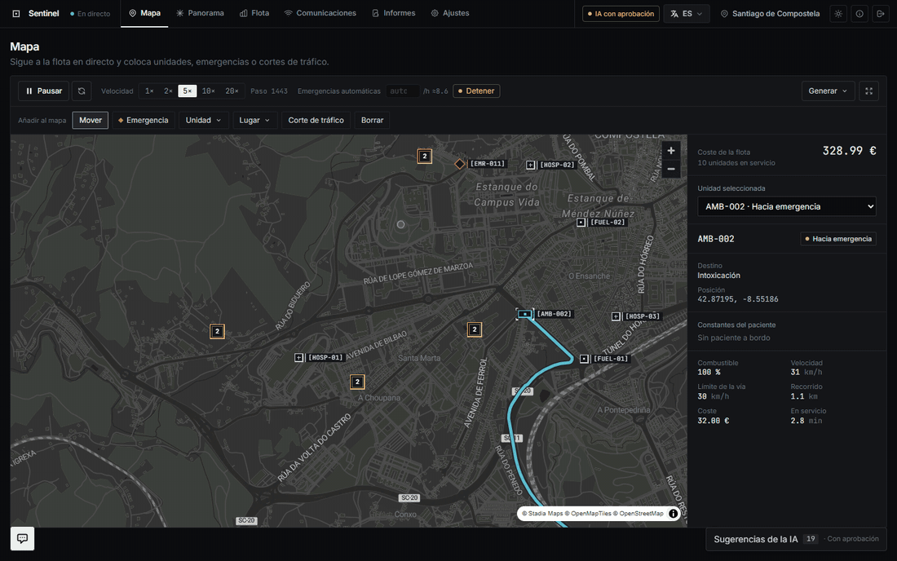
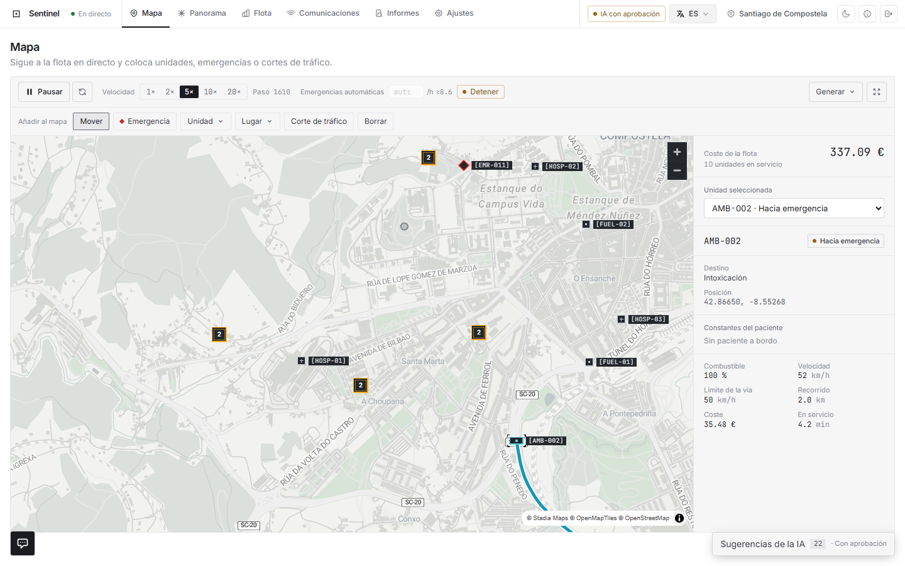
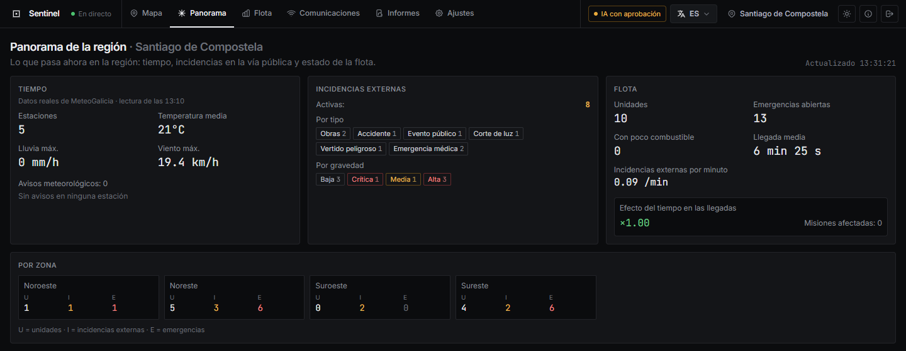
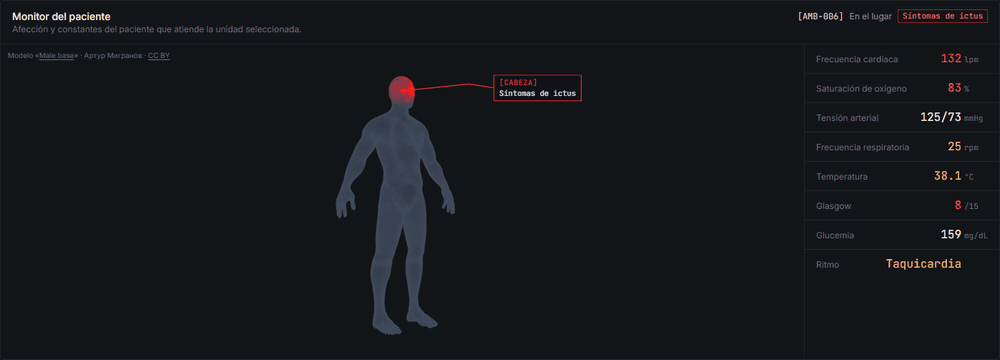
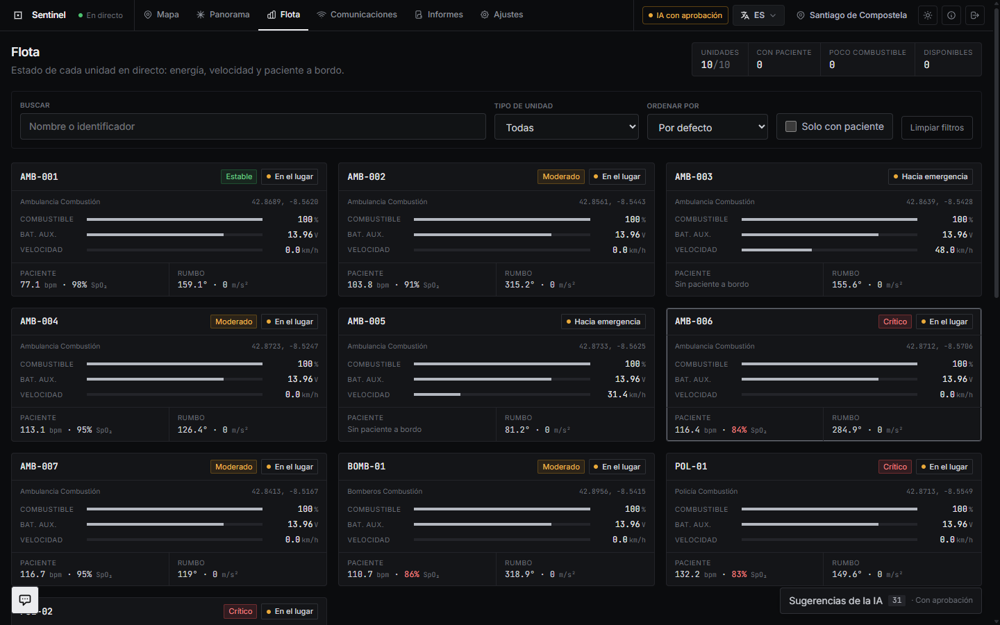
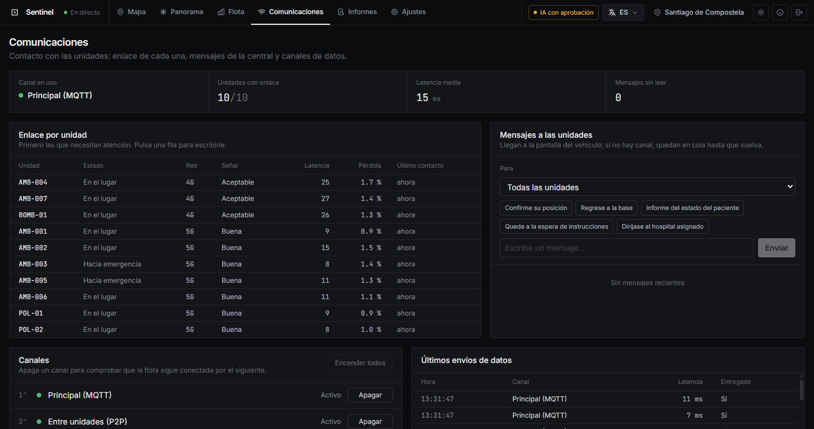
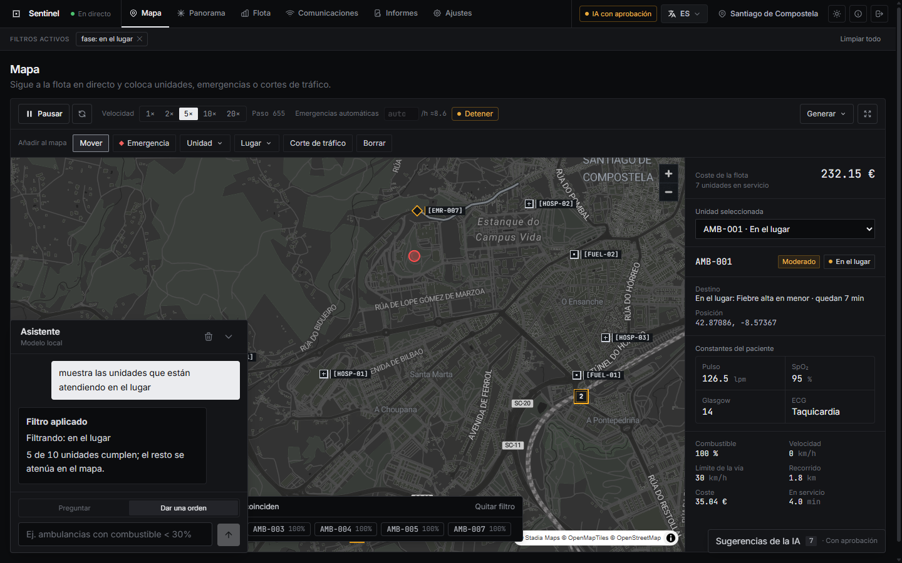
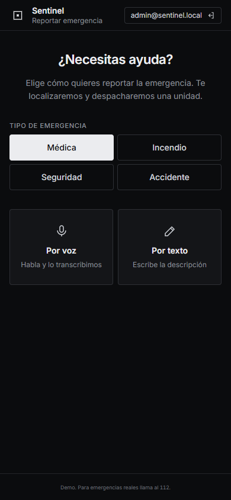

# Sentinel

Sentinel simula una flota de emergencias sanitarias en Santiago de Compostela y la muestra como la vería un centro coordinador. Ambulancias, bomberos y policía se mueven por las calles reales de la ciudad. Les llegan avisos, van al lugar, atienden, trasladan al hospital y vuelven a estar disponibles, y todo eso lo sigues en un mapa en directo.

Todo funciona en local: el mapa, las rutas, los datos de la ciudad, el tiempo real de MeteoGalicia y una IA que corre en tu propia máquina con Ollama. No hace falta ninguna cuenta ni clave de pago para probarlo.



## Qué hay dentro

### El mapa

Es la pantalla principal. Cada forma es un tipo de cosa:
- **Rectángulos**: unidades.
- **Rombos**: emergencias.
- **Cuadrados**: hospitales y gasolineras.

El color del borde dice cómo está cada una: cian si la unidad está operativa, ámbar si hay algo que vigilar y rojo si es una emergencia sin atender. Cuando alejas el mapa, lo que se amontona se agrupa en un cuadro con el número de elementos.

Al seleccionar una unidad ves su ruta, adónde va, a qué velocidad, cuánto combustible le queda y, si está atendiendo a alguien, las constantes del paciente. Desde la barra superior puedes acelerar la simulación, crear emergencias o cortes de tráfico con un clic, o generar un escenario completo.

El mapa sigue el tema de la aplicación: oscuro por defecto y claro si lo prefieres.



Nada de lo que aparece en el mapa está puesto al azar:
- **Lugares reales**: hospitales, gasolineras, parque de bomberos y comisarías son los de verdad, sacados de OpenStreetMap.
- **Emergencias en la calle**: cada aviso se coloca sobre una calle con nombre. Un accidente de tráfico cae en una avenida, no en mitad del monte.
- **Cortes que siguen la vía**: los cortes de tráfico cubren el tramo de calle afectado.

### Cómo se comporta la simulación

- **Avisos**: las emergencias salen de un catálogo de 28 tipos de llamada (dolor torácico, ictus, caída de una persona mayor, atropello, agresión, incendio…). Cada tipo tiene su frecuencia, su gravedad y su tiempo de atención. De noche cambia la mezcla, y el ritmo general sube y baja según la hora.
- **Misiones completas**: la unidad llega, atiende durante unos minutos y, si hace falta, traslada al paciente al hospital al que antes se llega. Allí lo entrega y queda libre.
- **Conducción**: las unidades van a la velocidad de cada calle (algo más rápido con sirena), frenan en las curvas cerradas y van despacio en los atascos.
- **Carga equilibrada**: por defecto el ritmo de avisos se ajusta para que la flota trabaje en torno al 65 % de su capacidad. Si se acumulan avisos sin unidad, la simulación frena hasta que la cola baja.

### Panorama

Un resumen de lo que pasa en la región:
- **Tiempo**: el que dan las estaciones reales de MeteoGalicia más cercanas.
- **Incidencias en la vía pública**: activas, por tipo y por gravedad.
- **Flota**: cuántas unidades hay, cuántas emergencias siguen abiertas y cuánto se tarda de media en llegar.



### Flota y monitor del paciente

En Flota tienes una tarjeta por unidad, con su estado, la energía que le queda y el paciente que lleva. Al seleccionar una que está atendiendo a alguien aparece el monitor del paciente: un cuerpo en malla con la zona afectada resaltada y sus constantes al lado.

La zona sale del tipo de aviso: un ictus marca la cabeza, un dolor torácico el corazón y una caída de una persona mayor la cadera. Las constantes simuladas son coherentes con la afección: una parada da fibrilación y tensión muy baja, y una descompensación diabética, la glucosa por los suelos. Todo es ficticio: no hay ni se guardan datos de salud reales.





### Comunicaciones

Sirve para saber con qué unidades tienes contacto:
- **Enlace de cada unidad**: qué red tiene (5G en el centro, 3G en las afueras), la calidad de la señal y cuándo dio señales por última vez. Las que necesitan atención aparecen arriba.
- **Mensajes**: puedes escribir a una unidad o a toda la flota. El mensaje aparece en la pantalla del vehículo y ves si quedó en cola, si se entregó o si ya lo han leído.
- **Canales de datos**: puedes apagarlos para comprobar que la flota sigue conectada por el siguiente.



### Asistente

Abajo a la izquierda hay un asistente con dos modos:
- **Preguntar**: consulta los protocolos y la documentación.
- **Dar una orden**: actúa sobre el panel. Le escribes «unidades trasladando paciente» o «ambulancias con menos del 30 % de combustible» y filtra el mapa.

Las órdenes habituales se resuelven al instante sin pasar por el modelo; el resto las interpreta la IA local.

También hay una IA que vigila la simulación y propone acciones: enviar un helicóptero si la ambulancia más cercana tarda demasiado, o mandar a repostar a una unidad con poco combustible. Por defecto espera a que apruebes cada propuesta, pero puede trabajar sola.



### Para los ciudadanos

Hay una pequeña aplicación móvil para avisar de una emergencia por voz o por texto. El aviso entra en la simulación como cualquier otro.



Las tripulaciones tienen su propio panel: ven su ruta con indicaciones giro a giro, la emergencia asignada y los mensajes de la central.

## Ponerlo en marcha

Necesitas Docker con Docker Compose y unos 10 GB libres. Con una GPU NVIDIA la IA responde en unos 10 segundos; sin ella también funciona, pero bastante más lenta.

```bash
cp .env.example .env
python3 scripts/generate-supabase-keys.py   # copia las claves que imprime en .env
docker compose --profile gpu-nvidia up -d   # o --profile cpu si no tienes GPU NVIDIA
```

La primera vez tarda unos diez minutos, porque descarga varias cosas:
- el mapa de calles de Galicia, que recorta a Santiago y convierte en un grafo de rutas;
- los modelos de IA, unos 2 GB;
- las imágenes de Docker.

Después arranca en segundos.

Cuando esté listo, abre http://localhost:5173. Los usuarios de prueba son `admin@sentinel.local` (centro coordinador) y `vehiculo@sentinel.local` (panel de la tripulación), y sus contraseñas están en tu `.env`. Pulsa **Generar** para crear un escenario y **Reanudar** para que empiece a moverse.

| Qué | Dónde |
|---|---|
| Aplicación | http://localhost:5173 |
| API de la simulación | http://localhost:8080 (especificación en `/openapi.yaml`) |
| Documentación | http://localhost:3001 |
| Base de datos (Supabase Studio) | http://localhost:54323 |

## Cómo está hecho

- **Interfaz**: Vue 3 con TypeScript y Tailwind, mapas con MapLibre sobre los estilos Alidade Smooth de Stadia Maps y el visor 3D con three.js. Está traducida al español, inglés y gallego.
- **Simulación**: un servicio en Python (FastAPI) mueve la flota, calcula las rutas con OSRM sobre el mapa de calles de Santiago y envía el estado a la interfaz varias veces por segundo.
- **Datos**: Supabase guarda el historial de eventos, las misiones, las lecturas meteorológicas y los protocolos que consulta la IA.
- **IA**: corre en Ollama dentro del propio Docker, con `qwen2.5:3b` para el texto y `nomic-embed-text` para buscar en los protocolos. Un servicio aparte (ONNX) detecta anomalías en la telemetría de la flota.
- **Comunicaciones**: las unidades envían su telemetría por MQTT. Si cae, pasan a un canal entre unidades y, después, a HTTP.

```
frontend/     Interfaz: mapa, panorama, flota, comunicaciones, panel del vehículo y app ciudadana
simulation/   Motor de simulación, API, IA y fuentes de datos (eventos y MeteoGalicia)
ml-service/   Detector de anomalías de la flota
supabase/     Migraciones de la base de datos
docker/       Mosquitto y la construcción del grafo de rutas
docs/         Documentación (VitePress)
scripts/      Comprobaciones: verify.sh, smoke.sh, check_realism.py, check_stability.py, check_balance.py
```

La documentación completa está en `docs/` y en http://localhost:3001 con el proyecto en marcha. «Modelo de simulación» explica con detalle cómo se generan los avisos, cómo conducen las unidades y qué es aproximado.

### Conectar datos de fuera

La simulación acepta incidencias y lecturas meteorológicas reales por HTTP, con el mismo formato que usa internamente:

```bash
curl -X POST http://localhost:8080/api/events/ingest \
  -H "Content-Type: application/json" \
  -d '{"id":"ev-1","type":"accident","severity":"high","title":"Colisión","description":"Dos turismos",
       "latitude":42.88,"longitude":-8.54,"radius_m":150,"started_at":"2026-10-03T10:00:00Z"}'
```

Por defecto genera incidencias de ejemplo por su cuenta (`EVENT_SOURCE=mock`) y lee el tiempo de MeteoGalicia (`WEATHER_SOURCE=meteogalicia`). Las dos cosas se cambian en `.env`.

### Desarrollar

```bash
bash scripts/verify.sh     # tipos, compilación, traducciones, Python y documentación
bash scripts/smoke.sh      # prueba el stack en marcha (añade --ai para probar también el chat)
```

Los cambios en la interfaz se ven al momento. Los del motor necesitan `docker compose restart simulation`, que reinicia la simulación desde cero.

## Lo que no hace

Conviene saberlo antes de sacar conclusiones:
- **Es una simulación**: los tiempos, frecuencias y constantes son aproximaciones razonables, no datos oficiales de ningún servicio de emergencias. Los datos médicos son ficticios.
- **Una sola ciudad**: hoy solo está Santiago de Compostela. La estructura admite más regiones, pero cada una necesita su grafo de rutas y sus lugares.
- **IA pequeña**: la IA local es un modelo de 3.000 millones de parámetros. Interpreta bien las órdenes y resume bien, pero sus respuestas sobre protocolos son básicas y a veces imprecisas. No sirve para tomar decisiones clínicas.
- **Mapa base**: viene de Stadia Maps, que no pide clave desde `localhost`. Para publicarlo en un dominio hay que darlo de alta en Stadia o poner una clave en `STADIA_API_KEY`.

## Créditos

- **Mapa de calles, lugares y rutas**: © colaboradores de [OpenStreetMap](https://www.openstreetmap.org/copyright) (ODbL). Rutas con [OSRM](https://project-osrm.org/).
- **Mapa base**: [Stadia Maps](https://stadiamaps.com/), [OpenMapTiles](https://openmaptiles.org/) y OpenStreetMap.
- **Tiempo real**: red de observación de [MeteoGalicia](https://www.meteogalicia.gal/).
- **Modelo 3D**: «[Male base](https://poly.pizza/m/eWGDnQ0jzmH)» de Артур Мигранов, licencia [CC BY 3.0](https://creativecommons.org/licenses/by/3.0/).
- **IA**: [Ollama](https://ollama.com/) con Qwen 2.5 y nomic-embed-text.

## Licencia

Código propietario; consulta [LICENSE](LICENSE).
